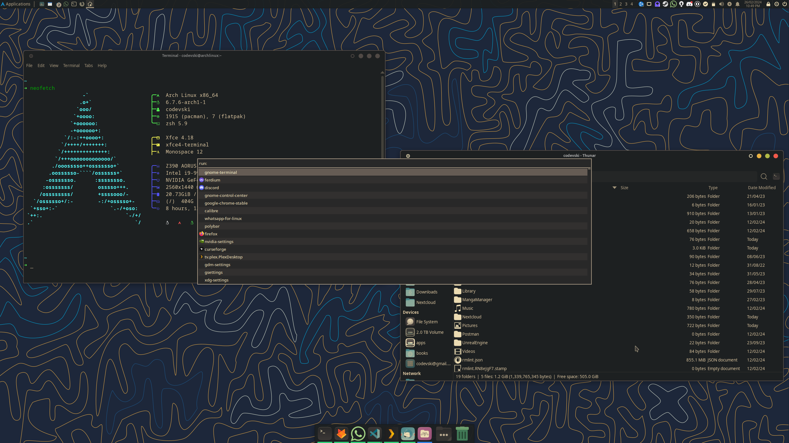

Dotfiles for KDE Plasma, Xfce, and a bunch of other applications I use, Gruvbox-themed.
Managed with [Dotdrop](https://github.com/deadc0de6/dotdrop). You can ignore `config.yaml` in the root directory if you are not using Dotdrop.

### Screenshot (XFCE)

### Notes

XFCE:

- Wallpaper: [com0570](https://github.com/AngelJumbo/gruvbox-wallpapers)
- Theme: [Gruvbox-Dark-BL](https://www.pling.com/p/1681313/)
- Icons: [Gruvbox Plus Icon Pack](https://www.pling.com/p/1961046/)
- Cursor: [Capitaine Cursors](https://www.pling.com/p/1818760/)
- Terminal: [Gruvbox (dark)](https://gist.github.com/tsbarnes/76724165773e834ea90c)
- VS Code: [Gruvbox Theme](https://marketplace.visualstudio.com/items?itemName=jdinhlife.gruvbox)
- Firefox: [Gruvbox](https://addons.mozilla.org/en-US/firefox/addon/gruvboxgruvboxgruvboxgruvboxgr/)
- Dock: [xfce4-docklike-plugin](https://docs.xfce.org/panel-plugins/xfce4-docklike-plugin/start)
- Optionals: [BreakTimer](https://breaktimer.app/), [Firefox Sidetabs](https://github.com/jeb5/Sidetabs)

No configs for panel, as I use [xfce4-docklike-plugin](https://docs.xfce.org/panel-plugins/xfce4-docklike-plugin/start)

Currently xfce4 terminal has a bug where presets are not applied. [Forum](https://forum.xfce.org/viewtopic.php?id=17269), [Issue](https://gitlab.xfce.org/apps/xfce4-terminal/-/issues/300)

`wallpapers` contain some of the wallpapers I have used. You can 'gruvify' any wallpaper with [com0570](https://github.com/AngelJumbo/gruvbox-wallpapers).

### Future Plans

Replace xfce4-docklike-plugin with [polybar]()
